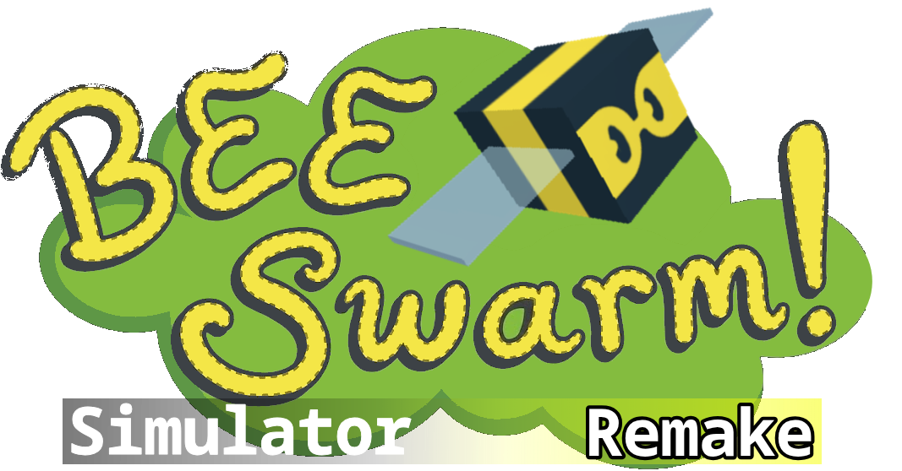
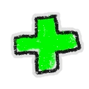
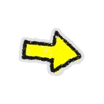
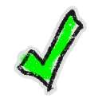
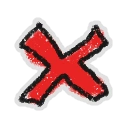
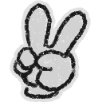
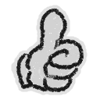
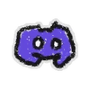
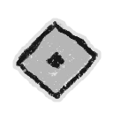

<div align="center">



A fan-made reimplementation of [Bee Swarm Simulator](https://www.roblox.com/es/games/1537690962/Bee-Swarm-Simulator) on Roblox.

</div>

---

## About

This project is a community-driven remake of Bee Swarm Simulator. It is **not affiliated with, sponsored by, or connected to Onett or the original BSS team** in any way.

The `.rbxl` file contains the full game. The supplementary folders (`assets/`, `music/`, `sfx/`) store source files for editing and reference — they are not required to run or modify the game.

---

## Getting Started

 Download and open the `.rbxl` file in [Roblox Studio](https://create.roblox.com/)

 All game logic, assets, and scripts are contained within the place file

 Make your edits directly in Studio — no external tooling required

---

## Project Structure

```
BeeSwarmSimulatorRemake/
├── BSSR.rbxl              # Main game file (open in Roblox Studio)
├── assets/                # Source assets for reference
│   ├── BeesFace/          # Bee icons by rarity (basic, rare, epic, mythic, event)
│   ├── BeesEmotes/        # Bee emote icons
│   ├── Eggs/              # Egg type icons
│   ├── Icons/             # BSS item & field icons, Roblox UI icons
│   └── Buttons/           # Menu button icons
├── music/                 # Music source files
├── sfx/                   # Sound effects (level up, legend discover)
└── README-assets/         # Stickers and images used in this README
```

---

## Disclaimer

 **NOT AFFILIATED WITH, COLLABORATING WITH, OR ASSOCIATED WITH ONETT OR BSS IN ANY WAY.**

 This is a fan project made for educational and recreational purposes.

---

<div align="center">



*Made with care by the community*

---

###  Follow Us

[ Discord](https://discord.gg/TTAkDRZqv8) · [ YouTube — IamDanteDev](https://youtube.com/@IamDanteDev) · [ YouTube — danteelgamerYT](https://youtube.com/@danteelgamerYT)

*Join the Spanish BSS community — connect, share, and grow together!*

[ Ver Créditos de BSS](CREDITS.md)

</div>
